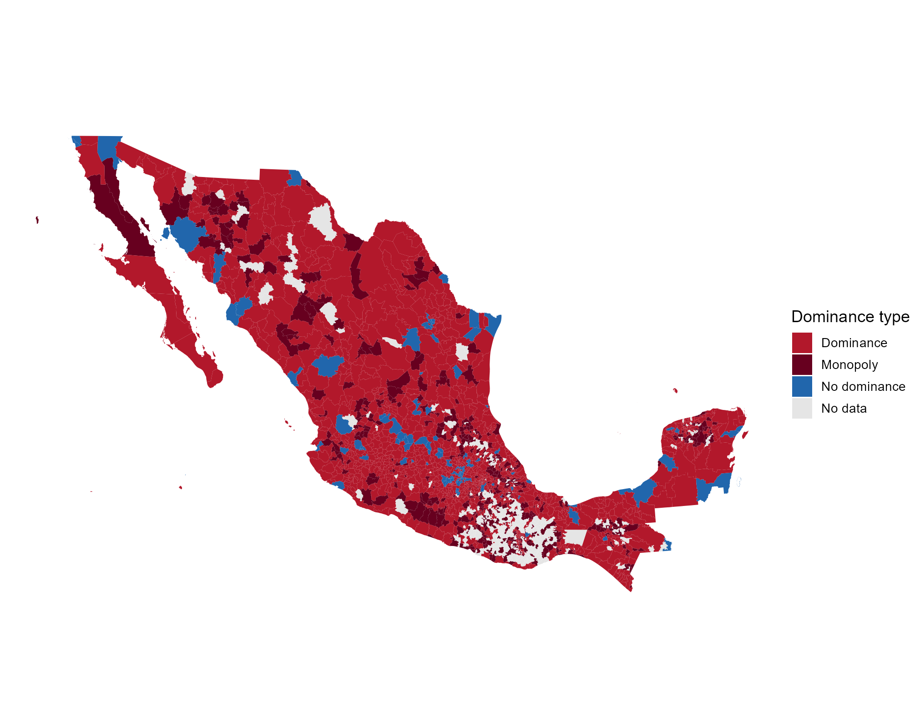
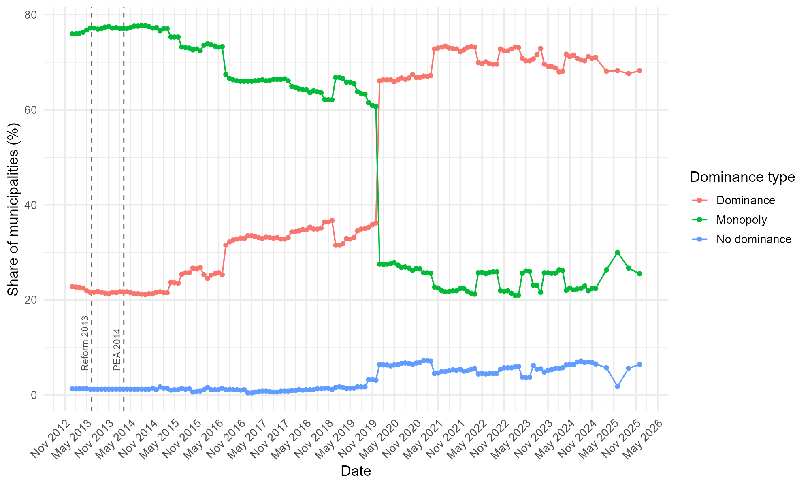
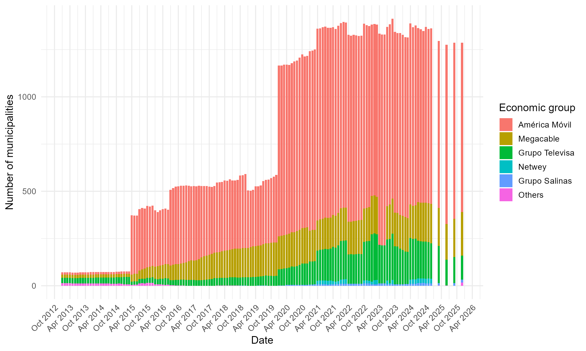
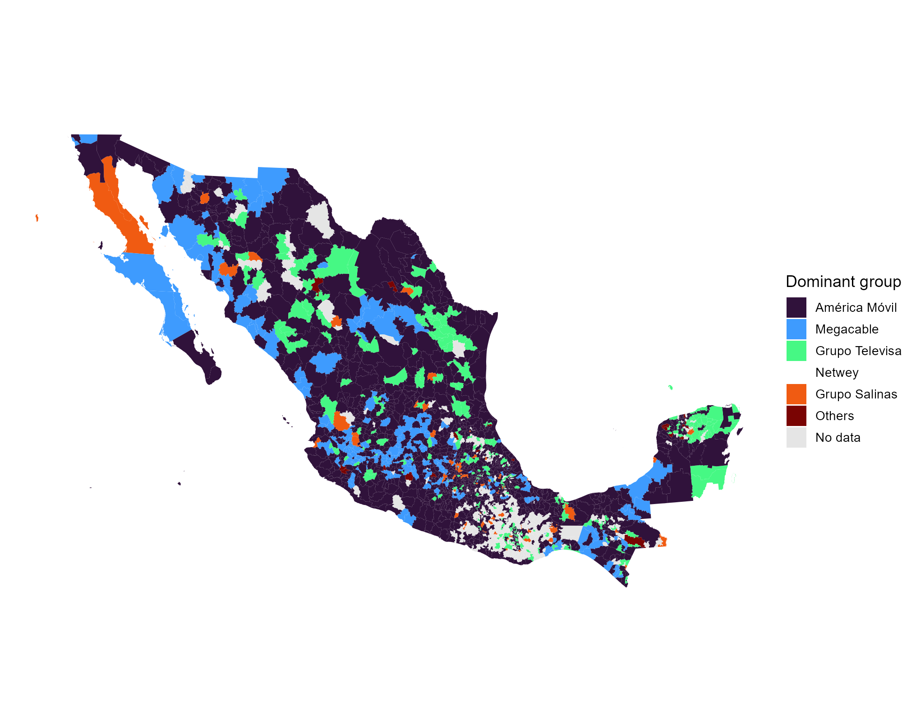

# Market Dominance in Mexico's Fixed Broadband Market, by Municipality (2013–2025)

> **Guiding question:** in what share of Mexico's municipalities, and in the hands of which economic groups, has market power concentrated in the fixed broadband service (SBAF) between 2013 and 2025, and how has that concentration evolved?

This project applies the dominance index of Melnik, Shy and Stenbacka (2008) to public data from Mexico's telecommunications statistics database (Banco de Información de Telecomunicaciones, BIT). The index is computed independently for each of 2,475 municipalities across 148 periods (monthly from 2013 to 2024, quarterly in 2025), using as many competitors as are reported in each municipality.


## Key findings

**1. By late 2025, dominance is the norm at the municipal level, not the exception.** In December 2025, across the 1,887 municipalities with data in the BIT:

| Classification | Municipalities | Share |
|---|---:|---:|
| Dominant group (a clear leader with at least one competitor) | 1,286 | 68.2% |
| Monopoly (a single group with reported accesses) | 481 | 25.5% |
| No dominance | 120 | 6.4% |

**2. One national operator leads almost everywhere.** América Móvil is the dominant group in 896 of the 1,286 municipalities with a dominant group (69.7%), followed by Megacable (230) and Grupo Televisa (127).

**3. Competition is geographically uneven.** Large urban markets tend to be the most competitive, while regional operators such as Megacable and Grupo Salinas split the mid-sized and small municipalities that the national operator does not contest. Baja California illustrates the pattern.

**4. The long-run trend must be read with caution.** The time series has sharp breaks (notably April 2015 and January 2020) that coincide with large jumps in how many operators report to the BIT. A relevant part of the observed "opening of markets" is likely a reporting artifact, not a sudden change in market structure. The December 2025 cross-section is the most reliable cut.



*Map 1. Dominance type by municipality, December 2025. Source: author's calculations with BIT data. Legend labels are in Spanish: dominancia = dominance, monopolio = monopoly, no dominancia = no dominance, NA = no data reported.*

## What "dominant" means here (and what it does not)

A municipality classified as dominant is **not** a legal finding of substantial market power or of a preponderant economic agent. Both legal figures require weighing all the criteria in Article 59 of Mexico's Federal Economic Competition Law (LFCE) and following a formal investigation procedure, not market share alone.

What the classification does identify is where the leading operator would, in principle, be able to set prices or restrict supply without local competitors being able to counter it effectively: a necessary, though not sufficient, condition for exercising market power.

## Method

**Data.** Market shares are measured by number of broadband accesses, by economic group and municipality, from the BIT (bit.ift.org.mx), which gathers the statistics that licensed operators must report to the regulator. Unlike the national exercise that served as a reference for this work, which considered only the three largest firms nationally, the index here is computed separately in every municipality.

**Index.** Rather than applying a fixed market-share threshold, the Melnik–Shy–Stenbacka index compares the share of the leading operator (s₁) with that of its closest competitor (s₂) and adjusts the dominance threshold according to a barriers-to-entry parameter (γ):

```
S^D = 0.5 × [1 − γ × (s₁² − s₂²)]
```

An operator is classified as dominant if s₁ > S^D. A municipality with a single reported group is classified as monopoly. In terms of Article 59 of the LFCE, the index operationalizes sub-sections I and III (own share versus competitors' shares), with γ as a simplified stand-in for sub-section II (barriers to entry). This analysis uses γ = 1 as the baseline case.

**Why this index.** It formalizes the same logic used in EU case law (a share of 50% or more is, absent exceptional circumstances, evidence of dominance, and 40% is an indicative floor below which single-firm dominance is unlikely) in a single, replicable formula. It also measures dominance rather than concentration: two markets with the same Herfindahl–Hirschman index can have very different structures, while dominance depends on the gap between the first and second competitor.

**Data preparation.** Four adjustments were applied to the BIT file before computing the index:

1. Dropped a block of empty records at the end of the file (no effect on results).
2. Normalized state and municipality codes to two and three digits, so that one municipality is not counted twice because of formatting inconsistencies.
3. Excluded records without municipal geocoding (code 99): 0.9% of rows and 3.3% of total accesses.
4. Fixed a calculation error in which the identification of the leader and the runner-up depended on the alphabetical order of group names instead of their actual market share.

The analysis is presented at two levels: the full monthly series (2013–2025) for all municipalities with data, and a cross-section at the most recent period (December 2025) for the geographic analysis.

## Results

### Evolution over time

Between 2013 and 2019 the share of municipalities classified as monopoly falls steadily, while the share classified as dominance (a clear leader with at least one competitor) rises. This is consistent with a gradual opening of markets previously served by a single provider.



*Figure 1. Monthly evolution of dominance type by municipality (% of municipalities), 2013–2025. Source: author's calculations with BIT data. Vertical lines: telecommunications constitutional reform (June 11, 2013) and the declaration of América Móvil as preponderant economic agent (March 6, 2014).*

### A structural break, and why it should not be read at face value

Between late 2019 and 2020 the series breaks abruptly: monopoly municipalities fall from about 60% (60.7% in December 2019) to about 28% (27.5% in January 2020), and dominance jumps from 36% to 66%. This coincides with new statistical reporting guidelines issued by the regulator in 2020, which substantially widened the universe of operators obliged to report to the BIT.

A robustness check supports a reporting explanation. Counting, month by month, in how many distinct municipalities each of the five largest groups appears reporting (whether or not it dominates there), América Móvil goes from reporting in 32 municipalities to 1,554 between March and April 2015, and Grupo Televisa from roughly 200 to 1,399 in January 2020. Both jumps are too large and too sudden to reflect real expansion of coverage.

The most plausible reading is that a relevant part of the breaks in the series reflects changes in BIT reporting coverage, not only real changes in market structure. There is no documented explanation for these breaks, and it was not possible within the time available to fully separate the two effects.

### Geography of dominance, December 2025

The "monopoly" category concentrates visibly in the north and northwest of the country, and "no dominance", the most competitive scenario under this criterion, is the least frequent of the three nationwide.

An unanticipated pattern is the geographic concentration of municipalities with no data at all in the BIT ("NA" on the map), mostly in the south, particularly Chiapas and parts of Guerrero and Oaxaca. Missing data is consistent with two non-exclusive explanations: lack of fixed broadband supply in those areas, or the presence of operators below the threshold that obliges them to report. Either way, it points to a digital-divide question that deserves its own exercise, separate from market dominance.

### Which groups dominate

Figure 2 ranks the groups by number of dominated municipalities: América Móvil first, followed at a considerable distance by Megacable, Grupo Televisa, Netwey and Grupo Salinas.



*Figure 2. Municipalities dominated by economic group, 2013–2025. Source: author's calculations with BIT data. The five groups with the largest presence are shown; the rest are grouped as "Otros" (Others).*

Three cuts show the pattern. Grupo Televisa led in January 2013 (28 municipalities, against 17 for Megacable and 13 for América Móvil). By July 2019 América Móvil led with 334 municipalities (Megacable 169, Televisa 50), and in December 2025 it dominates 896. As described above, these comparisons across periods are affected by changes in reporting coverage.


*Figure 3. Municipalities dominated by group at three cuts: January 2013, July 2019 and December 2025. Source: author's calculations with BIT data.*



*Map 2. Dominant economic group by municipality, December 2025. Source: author's calculations with BIT data. Only the five groups with the largest presence are shown; the rest are grouped as "Otros" (Others).*

### A closer look: the Baja California peninsula

- In **Baja California**, the two most populous municipalities, Tijuana (América Móvil, 38.5% share) and Mexicali (América Móvil, 41.3%), are classified as non-dominant: they are the most competitive markets in the state.
- **Tecate** and **Playas de Rosarito** are dominated by Megacable (61.1% and 38.9%).
- **San Quintín** and **San Felipe**, the two least populated and most remote municipalities from the border, are classified as monopoly (100%, Grupo Salinas).
- In **Baja California Sur**, Megacable dominates Comondú, Mulegé and Loreto (79%, 79% and 84%), while América Móvil dominates the two most populous and touristic municipalities, La Paz (57%) and Los Cabos (64%).

The pattern is consistent with the rest of the country: competition concentrates in the largest urban markets, while Megacable and Grupo Salinas split the mid-sized and small municipalities that América Móvil does not contest.

## Discussion: implications for policy

Three points follow for the fixed-telecommunications policy discussion.

1. **Municipal dominance is widespread and persistent.** Asymmetric regulation centered on a single national designation of a preponderant agent does not necessarily capture the geographic heterogeneity of market power. A group may not be preponderant nationally and still be dominant in most of the municipalities where it operates, as Megacable and Grupo Salinas in Baja California show.
2. **The institutional transition is a coordination challenge, not only a change of acronyms.** Competition authority moved from the former IFT to the new National Antimonopoly Commission (CNA), which declares preponderance and imposes asymmetric measures, while the Telecommunications Regulatory Commission (CRT) implements and monitors them on the ground. That division of powers requires agile coordination mechanisms.
3. **The coordination design should include an explicit subnational component.** If dominance is heterogeneous at the municipal level, both the criteria the CNA uses to declare preponderance and the way the CRT prioritizes territorial supervision should account for it, rather than replicating at two desks the aggregate national approach that existed under the IFT.

<details>
<summary><b>Regulatory background</b></summary>

On June 11, 2013, the constitutional reform in telecommunications created the Federal Telecommunications Institute (IFT) as an autonomous constitutional body, with simultaneous powers of technical regulation and competition authority for telecommunications and broadcasting. On March 6, 2014, the IFT declared the economic interest group represented by América Móvil as the Preponderant Economic Agent (AEP) in telecommunications, and imposed asymmetric regulation to correct the market's structural failures.

In fixed broadband, the measures on the AEP included effective unbundling of its local network (access to its physical, technical and logical infrastructure through regulated reference offers), functional separation of its business units, and an obligation to report statistical information periodically to the regulator, which is the origin of the BIT data used here. The law required reviewing these measures every two years. In the regulator's own words, the AEP's national share in fixed broadband fell from 73% in 2013 to 39% a decade later.

In 2025 the institutional arrangement changed: the IFT's extinction gave way to the CRT and the CNA, the latter in charge of competition in telecommunications since October 17, 2025. Both are attached to federal executive agencies and are no longer constitutionally autonomous, at a time when the USMCA requires the telecommunications regulator to be independent of the operators it regulates. This project does not evaluate that change in depth, since sufficient data is not yet available to do so with the same empirical rigor; it is noted as context for tracking the sector's competition agenda.

</details>

## Limitations

- **Reporting breaks.** Large jumps in how many operators report to the BIT (April 2015, January 2020) mean level comparisons across periods should be read with caution. The December 2025 cross-section is the most reliable cut.
- **Monopoly means a single reported group** in that municipality and period.
- **Missing data (NA).** The BIT does not distinguish between real absence of supply and operators below the reporting threshold.
- **Unit and scope of analysis.** The municipality, for fixed broadband only. No substitution with other services, and no prices.
- **Not an official determination.** The index is an analytical exercise, not a finding of substantial market power or of a preponderant economic agent. Unlike an official designation, however, it is replicable and can be updated with each new BIT release.

## Repository structure

```
README.md
docs/        Full document (Spanish): context, method, results, discussion
R/           Dominancia.R, the full analysis script
data/        Input data and sources (see data/README.md)
output/      Charts, maps and tables generated by the script
figures/     Figures used in this README
```

## How to replicate

1. Get the data from `data/` (see [`data/README.md`](README.md)).
2. Open `R/Dominancia.R` and change the three paths in the *Parámetros* block (instructions are in the comments).
3. Install the packages: `dplyr`, `readr`, `ggplot2`, `lubridate`, `openxlsx`, `sf`, `stringi`, `forcats`.
4. Run the script. It writes charts, maps and tables to the output folder.

## References

- Banco de Información de Telecomunicaciones (BIT), bit.ift.org.mx.
- European Commission (2009). *Guidance on the Commission's Enforcement Priorities in Applying Article 82 EC Treaty to Abusive Exclusionary Conduct by Dominant Undertakings*. OJ C 45/7.
- Diario Oficial de la Federación (June 11, 2013). Decree reforming the Mexican Constitution on telecommunications (Articles 6, 7, 27, 28, 73, 78, 94 and 105).
- Instituto Federal de Telecomunicaciones (March 6, 2014). Resolution P/IFT/EXT/060314/76, declaration of the Preponderant Economic Agent in telecommunications.
- Instituto Federal de Telecomunicaciones (2020). *Lineamientos para integrar el Acervo Estadístico del IFT*. DOF, January 24, 2020 (in force November 19, 2020).
- Ley Federal de Competencia Económica, Article 59 (current text, last amended DOF 07-16-2025).
- Melnik, A., Shy, O., & Stenbacka, R. (2008). Assessing market dominance. *Journal of Economic Behavior & Organization*, 68(1), 63–77.

## Author

Iván Torres · Economist · [github.com/ivang019](https://github.com/ivang019)
